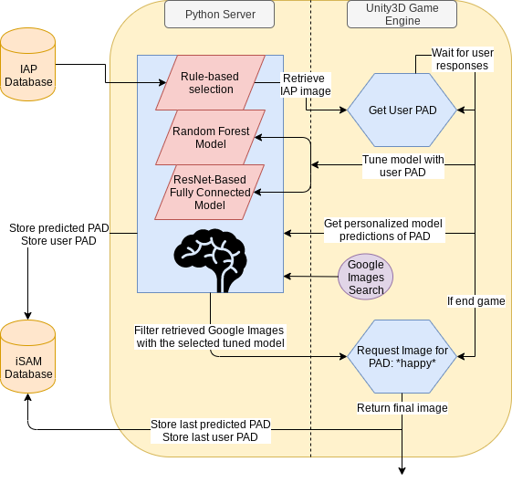
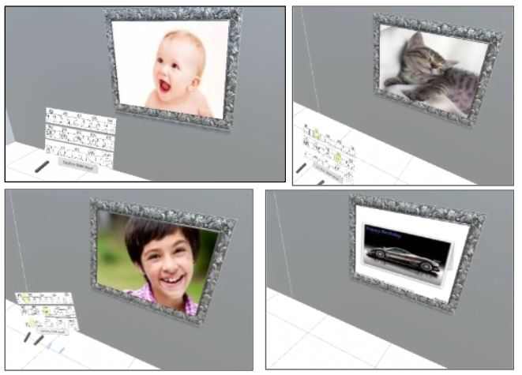

# iSAM
This project fine-tunes an affective model to player nuances using the SAM (Self-Assessment Manikin) and immersive media (HTC Vive and Unity VR).

Paper submitted and in review.

#### This is the software strucure for iSAM

#### This is the predictions of pictures that players would like, post tuning

# Target Unity Version: 2019.2.11f1
@ Group: Aviv Elor and Asiiah Song
